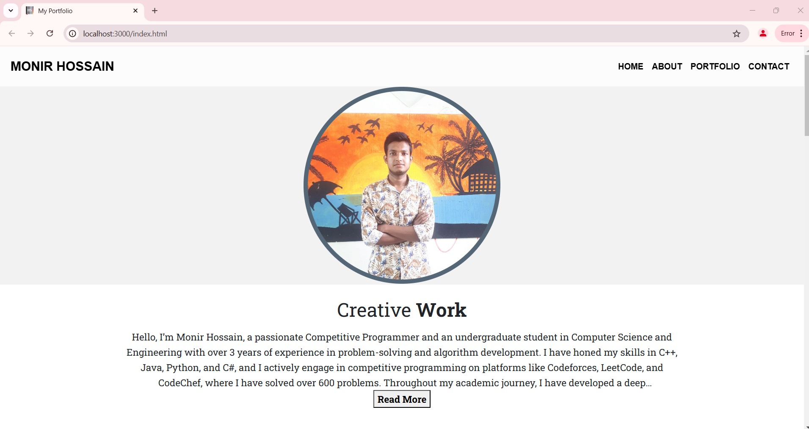

# Portfolio Website

Welcome to my portfolio website repository! This project is designed to showcase my skills, projects, and professional experience in a visually appealing and interactive manner. It highlights who I am, what I do, and my journey as a professional.

## Screenshot:


## Features

- **Responsive Design:** The website is fully responsive and optimized for various screen sizes, ensuring a great user experience on desktops, tablets, and mobile devices.
- **Dynamic Navbar:** A scroll-based effect enhances the navigation bar for better aesthetics and usability.
- **"Read More" Section:** The "About Me" section includes a toggleable text area, allowing users to read more or less content.
- **Showcase Projects:** Features a dedicated section to display my projects with links to live demos or repositories.
- **Contact Form:** An interactive form enables visitors to contact me directly.
- **Social Media Links:** Easy access to my professional social media profiles.

## Technologies Used

- **HTML5** and **CSS3** for structure and styling.
- **JavaScript** for interactive elements like the scroll-based navbar and "Read More" functionality.
- **Font Awesome** for icons used across the website.
- **Custom CSS Animations** to make the website lively and engaging.

## Installation

Follow these steps to set up the project locally:

1. Clone the repository:
   ```bash
   git clone https://github.com/monir-devx/Portfolio-Website.git
   ```
2. Navigate to the project directory:
   ```bash
   cd Portfolio-Website
   ```
3. Open the `index.html` file in your preferred browser to view the website.

## Usage

- **Homepage:** Get an overview of who I am and my professional highlights.
- **Projects Section:** Explore the projects I have worked on, including brief descriptions and links.
- **Contact Section:** Use the form to send messages or inquiries.

Thank you for visiting my repository!
